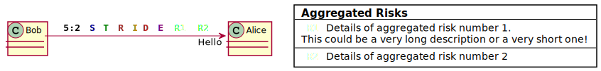
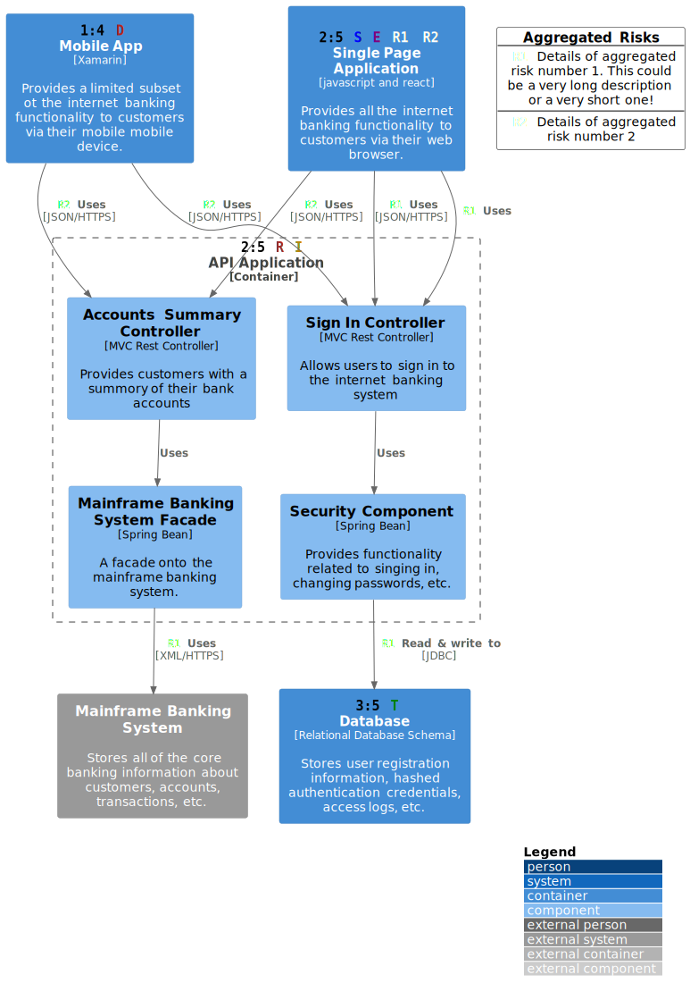

# STRIDE PlantUML

_PlantUML functions to add STRIDE labels to diagrams._

[STRIDE](https://en.wikipedia.org/wiki/STRIDE_(security)) is a model of threats for software systems and is commonly used when performing threat modelling of software architectures. This project provides [PlantUML](http://plantuml.com/) functions to annotate PlantUML architecture diagrams (specifically [C4 model diagrams](https://c4model.com)) with STRIDE labels.

Other labels are also provided:

* Trust:Value ratio labels: _Trust_ represents how much you trust the environment the component is in and _Value_ represents the value of the data that component has access to.
* Aggregated risks: Sometimes it can be onerous to label **all** of the threats associated with a component. In this case it can be useful to _aggregate_ the risks into a labelled entity that describes the mitigations for the risk taken.

## Examples

The [examples](./examples) folder contains some example PUML files that use these functions.

Here is a basic usage example:

Here is an example C4 model diagram using the [C4-PlantUML](https://github.com/RicardoNiepel/C4-PlantUML) library. The labels are not intended to indicate actual threats, merely to demonstrate the functionality of this library.

